# Fatwood

**Kindling for your next build** · [fatwood.io](https://fatwood.io)

Fatwood is the resin-saturated heart of a pine — the wood that catches fire
from a single spark. This app is that, for engineers: it finds the research
papers that will actually ignite your next project.

arXiv publishes ~300 papers a day in machine learning, security, software
engineering, and quantitative finance alone. Somewhere in this week's batch
is a paper that would make a fantastic project for *you specifically* — the
right topic for where your career is going, the right scope for a solo
build, maybe a result nobody has reproduced in public yet. The problem is
finding it: keyword search doesn't know you, category feeds are a firehose,
and reading 300 abstracts a day is a job.

Fatwood closes that gap. Describe what you're after in plain
language — career goals included:

> *"I want to move from backend work into applied machine learning — looking
> for a weekend-scale project on anomaly detection. I have four years of
> Java experience."*

— and get back a ranked shortlist of real, current papers, each scored for
how buildable it is **by you**: what you'd learn, how long it would take,
what it says on a resume, and an extension idea that plays to your
strengths. Plus a couple of deliberate *wildcards* from outside your comfort
zone, because the goal is to expand what you can build, not echo what you
already know.

## Project goals

Principles set at the start; each is enforced somewhere concrete in the code.

- **Search quality must be measurable — or none of this means anything.**
  An evaluation harness turns "are the results good?" into a number (nDCG
  over ~3,300 graded relevance judgments). No ranking change ships unless
  the number goes up; several "obviously good" ideas died in measurement,
  and that's the system working.
- **Exploration is protected, structurally.** A great project must never be
  missed over a skill you could learn in a weekend. Experience similarity
  annotates results but never ranks or gates them; wildcard slots are a
  contractual guarantee; analysis treats unfamiliar tools as learnable,
  never as blockers.
- **Tokens are spent deliberately and visibly.** The LLM never filters the
  corpus — it compiles your intent (once per search) and analyzes papers you
  explicitly choose, on the cheapest capable model, with live dollar
  estimates in the UI. Browsing and searching cost zero tokens, always.
- **Real data only.** Every paper is live from arXiv, every citation from
  Semantic Scholar, every quality claim from actual measurement. Mock data
  is banned from the product path.
- **Improve from real usage — with a human in the loop.** Every search and
  reaction is logged; reports surface biases and candidates; nothing retunes
  itself automatically. Detect automatically, tweak deliberately.
- **Open to anyone, safe to run.** Real accounts (Entra External ID, rendered
  natively in-app), a per-user dollar budget bounding every account's spend,
  rate limiting and bot protection at every layer, and cost alarms above it
  all — shareable without fearing the bill.
- **Production-grade, portable engineering.** Provider-swappable database,
  89 tests, infrastructure as code, CI/CD — built to hold up under review.

## How a sentence becomes insights

1. **One LLM call compiles your prose into a transparent, editable plan** —
   concrete research topics, category filters, a date window, shown as chips.
   Editing a chip re-runs the search free: only compilation and opt-in
   analysis ever spend tokens.
2. **SQL filters** narrow ~28k papers to your candidates in milliseconds.
3. **Meaning does the ranking**: every abstract is a point in a
   384-dimensional space (local embeddings — bge-small via ONNX, no API);
   relevance is geometric closeness to your intent *and* your best-matching
   topic.
4. **Exact words get a vote**: a BM25 text index runs in parallel and the
   rankings fuse — this hybrid measured **+17% nDCG** over embeddings alone.
5. **Wildcard slots** inject high-relevance papers least similar to your
   experience before results render.
6. **Opt-in analysis** reads each chosen paper against your profile:
   feasibility, learning bridge, goal alignment, resume story, extension
   idea. Cached forever per paper × profile version.
7. **Every search feeds the quality loop**: telemetry + an offline eval
   harness (frozen queries, graded judgments, nDCG/Recall/MRR) gate every
   ranking change. The current pipeline exists because measurement picked it.

## Tech stack

| Layer | Choice |
|---|---|
| Backend | .NET 10 / ASP.NET Core, layered (Domain / Application / Infrastructure / Api), dual web + CLI entry point |
| Data | PostgreSQL via EF Core — provider-swappable to SQL Server by design (no raw SQL, no pg-only types) |
| Search | Local ONNX embeddings (bge-small-en-v1.5) + in-memory BM25, Reciprocal Rank Fusion, optional cross-encoder |
| LLM | Anthropic API (structured outputs), config-driven model registry with per-step selection and pricing |
| Frontend | React + TypeScript (Vite), no UI framework |
| Accounts | Entra External ID with native (in-app) auth, per-user budget ledger, BYO API keys (encrypted, write-only), branded email via Azure Communication Services |
| Edge | Cloudflare (DDoS/bot protection, strict TLS), ASP.NET rate limiting, CSP/HSTS |
| Quality | Offline IR eval harness (nDCG/Recall/MRR vs LLM-judged ground truth), search telemetry, interleaving experiments |
| Delivery | Docker single-image (API + SPA), Bicep IaC, GitHub Actions CI/CD (OIDC, no cloud secrets), Azure Container Apps + cron jobs, Key Vault |
| Tests | 89 xUnit tests: unit (real fixtures, pinned metrics) + integration (full API over in-memory Sqlite) |

## Documentation

| Doc | What's in it |
|---|---|
| [docs/running.md](docs/running.md) | Prerequisites, local dev loop, packaged app, configuration, SQL Server swap, tests |
| [docs/operations.md](docs/operations.md) | Ingestion, embeddings, analysis, enrichment — CLI + admin API, cost controls |
| [docs/accounts.md](docs/accounts.md) | Accounts platform: native auth, budget ledger, BYO keys, branded email, the perimeter |
| [docs/search-quality.md](docs/search-quality.md) | The eval harness, measurement protocol, ranking campaign results, improvement roadmap |
| [docs/design-decisions.md](docs/design-decisions.md) | Every explicit trade-off, from arXiv API choice to exploration guardrails |
| [DEPLOY.md](DEPLOY.md) | Azure deployment: Bicep, OIDC CI/CD, Key Vault, migration bundles |

*Architecture diagram source: [docs/architecture.mmd](docs/architecture.mmd) —
re-render with `npx -y @mermaid-js/mermaid-cli -i docs/architecture.mmd -o docs/architecture.svg -b transparent`.*
