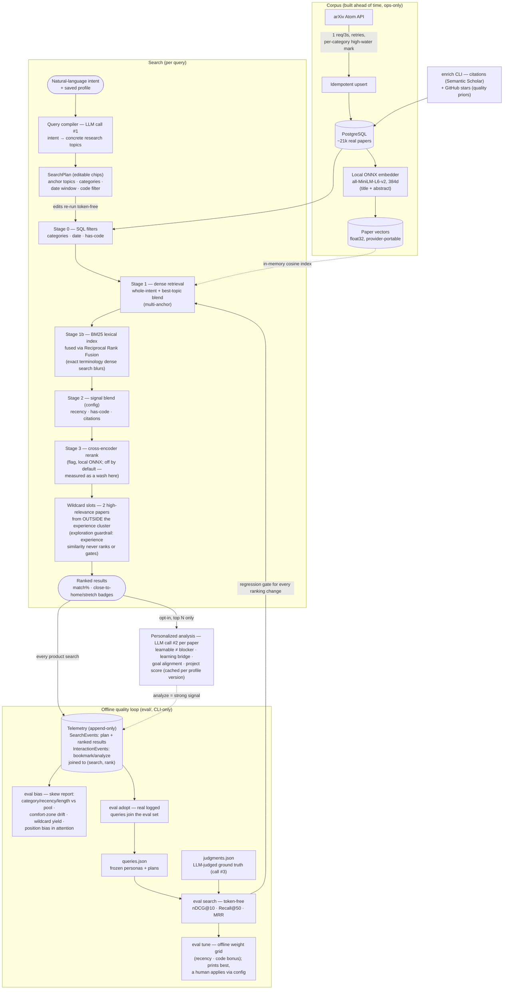

# Research Discovery

A research-to-project discovery tool: browse recent arXiv papers by category to
find portfolio-project candidates. Phase 1 ingests real paper metadata from the
official [arXiv API](https://info.arxiv.org/help/api/index.html) into
PostgreSQL and serves a fast, filterable browse UI. Phase 2 runs an
inexpensive LLM (Anthropic `claude-haiku-4-5` by default) over bounded,
admin-selected subsets of papers to score their suitability as solo portfolio
projects, and surfaces the stored analysis in the browse UI (score sort,
analyzed-only filter, per-paper detail).

**No mock data anywhere in the product path** — every paper row comes from the
live arXiv API. Tests use saved real responses as fixtures; the running app
always hits arXiv.

## Architecture

```
src/
  ResearchDiscovery.Domain/          Entities only, zero dependencies
  ResearchDiscovery.Application/     Interfaces, options, DTOs (no EF, no HTTP)
  ResearchDiscovery.Infrastructure/  EF Core + Npgsql, arXiv client, ingestion
  ResearchDiscovery.Api/             Web host + controllers + scheduler + CLI mode
tests/
  ResearchDiscovery.UnitTests/       Atom parser tests against a real fixture
  ResearchDiscovery.IntegrationTests/API + upsert tests over in-memory Sqlite
web/                                 React + TypeScript (Vite) browse UI
```

- **Ingestion** is an ops concern with two entry points: a CLI command
  (`ingest backfill|delta`) and an API-key-protected admin endpoint. Regular
  users have no route that can trigger ingestion.
- Ingestion is **idempotent** (upsert keyed on the unique arXiv ID) and tracks
  a **per-category high-water mark** so the daily job only fetches the delta.
- **Browsing** is served entirely from the database and never calls arXiv or
  the LLM.
- A cross-process **database lease** (single row + concurrency token)
  serializes the scheduler and the CLI, which run in separate processes.
- **Analysis** (Phase 2) is an ops concern with the same two-entry-point shape
  as ingestion: a CLI command (`analyze <category>`) and an API-key-protected
  admin endpoint. Regular users have no route that can trigger an LLM call.
  Runs are bounded by construction (one category, capped paper count) and
  idempotent: already-analyzed papers are never re-sent to the model.

### How a query becomes results

The end-to-end path from natural-language intent to ranked, personalized
results — and the offline loop that keeps the ranking honest. LLM calls are
marked; everything else is deterministic and token-free.



## Prerequisites

- .NET 10 SDK
- Node.js 20+ (for the frontend)
- Docker (for PostgreSQL locally, and for the packaged image)

## Run locally (dev loop)

```bash
# 1. Start PostgreSQL
docker compose up -d postgres

# 2. Run the API (applies migrations on startup; listens on :5080)
dotnet run --project src/ResearchDiscovery.Api --launch-profile http

# 3. Run the initial backfill (separate terminal; takes a while at 1 req/3s)
dotnet run --project src/ResearchDiscovery.Api -- ingest backfill

# 4. Run the frontend (proxies /api to :5080; open http://localhost:5173)
cd web && npm install && npm run dev
```

For a faster first backfill while trying things out:

```bash
dotnet run --project src/ResearchDiscovery.Api -- ingest backfill --days 7 --max-per-category 300
```

The high-water-mark design self-heals: if a capped backfill stops early, the
next `ingest delta` continues from where it left off.

## Run the packaged app (single container)

```bash
docker compose up -d --build          # postgres + api (SPA served at :8080)
docker compose run --rm api ingest backfill   # args go to the image entrypoint
docker compose run --rm api analyze cs.LG --max 25   # needs ANTHROPIC_API_KEY in the host shell
# then browse http://localhost:8080
```

## Ingestion

### Manual triggers (admin/ops only)

CLI (preferred for local/initial backfill — not reachable over HTTP at all):

```bash
dotnet run --project src/ResearchDiscovery.Api -- ingest backfill [--days N] [--max-per-category N]
dotnet run --project src/ResearchDiscovery.Api -- ingest delta
```

Exit codes: `0` success, `1` run failed, `2` another run holds the lease,
`64` usage error.

HTTP admin endpoints exist for remote ops, but **only when an admin API key is
configured** (`Admin:ApiKey` / `Admin__ApiKey`). Without a key they return 404
— an unconfigured deployment has no admin surface:

```bash
curl -X POST -H "X-Admin-Api-Key: $KEY" http://host/api/admin/ingestion/backfill   # 202
curl -X POST -H "X-Admin-Api-Key: $KEY" http://host/api/admin/ingestion/delta      # 202
curl        -H "X-Admin-Api-Key: $KEY" http://host/api/admin/ingestion/runs        # status
```

Backfills run asynchronously (a 202 + a queue) because a full backfill takes
tens of minutes at arXiv's rate limit.

### Scheduled daily job

`DailyIngestionHostedService` runs a delta ingestion once a day at
`Ingestion:Schedule:TimeUtc` (default `06:30` UTC). It fetches, per category,
only papers submitted after that category's stored high-water mark. Disable
with `Ingestion__Schedule__Enabled=false`. Overlap with a manual run is
prevented by the database lease — whoever loses logs a warning and skips.

On Azure Container Apps, keep `minReplicas: 1` (scale-to-zero would kill the
in-process scheduler). The production-grade evolution is an ACA cron **Job**
running `ingest delta` on this same image with the scheduler disabled.

## Personalized discovery (Phase 2)

Phase 2 turns the corpus into personalized recommendations. The design rule
throughout: **the LLM never filters the corpus** — it compiles search intent
(one cheap call per search) and analyzes ranked survivors (one call per
paper), while the sift itself runs on free local embeddings. Full design:
`docs/phase-2-redesign.md`.

### Profile

Your experience and goals live in a single versioned profile (Settings UI, or
`PUT /api/admin/settings/profile`). Analysis is a paper × person judgment, so
every saved edit bumps the profile version and marks existing analyses stale;
they re-run on the next analysis pass (nothing is deleted).

### Local embeddings (zero tokens)

Every paper's title + abstract is embedded with a local all-MiniLM-L6-v2
model (ONNX Runtime; ~90 MB of model files download automatically on first
use into `Embeddings:ModelDirectory`). Vectors are stored as portable float32
bytes — no pgvector, so the SQL Server swap still holds — and ranked by an
in-memory cosine index. Ingestion embeds new papers automatically; backfill
the corpus once with:

```bash
dotnet run --project src/ResearchDiscovery.Api -- embed
```

### Smart search (Discover tab)

Describe what you want in plain language — career goals included. One LLM
call compiles it into a **search plan**: an interpretation line, concrete
research topics (the embedding anchor), category filters, a date window, and
an optional no-public-code filter. The plan renders as editable chips;
editing a chip re-executes the plan **without another LLM call**, because
`POST /api/search` takes plans, not prose (`POST /api/search/compile`, admin
key required, is the only endpoint that spends tokens).

Exploration guardrails are structural: relevance is the only ranking signal,
experience similarity merely annotates hits ("close to home" / "stretch"),
and every result set reserves wildcard slots — high-relevance papers sampled
from *outside* your experience cluster.

### Model selection & cost visibility

Every LLM step has a UI-selectable model (Settings → Models per step),
validated against the config-driven registry in `Llm:Models`, which carries
per-MTok pricing so action buttons show live dollar estimates ("Analyze top
25 — est. $0.05"). Bulk steps default to the cheapest tier.

## Analysis

Analysis evaluates each paper **for you specifically** (contract v2):
feasibility counts only hard blockers — unfamiliar languages or frameworks
are explicitly *not* blockers — plus a learning bridge (what you'd learn and
how long), goal alignment against your stated goals, a personalized resume
story, and an extension idea that plays to your strengths. Structured outputs
enforce the JSON contract server-side. If the model declines a paper
(possible with security papers; cs.CR is a target category), the paper is
recorded as declined and skipped — that costs nothing. For deployments where
declines matter, `Analysis:FallbackModel` opts into a server-side fallback
inside the same API call; if set, pick another inexpensive model.

Set the API key in the environment — it is never read from appsettings:

```bash
export ANTHROPIC_API_KEY=sk-ant-...
```

### Manual triggers (admin/ops only)

CLI (one category per run, newest papers first, capped):

```bash
dotnet run --project src/ResearchDiscovery.Api -- analyze cs.LG [--max N] [--since-days N]
```

Exit codes: `0` success, `1` one or more papers failed, `64` usage error /
unknown category.

HTTP admin endpoints (same `X-Admin-Api-Key` posture as ingestion — 404
without a configured key):

```bash
curl -X POST -H "X-Admin-Api-Key: $KEY" -H "Content-Type: application/json" \
  -d '{"categoryCode":"cs.LG","maxPapers":25,"sinceDays":30}' \
  http://host/api/admin/analysis/run                                    # 202
curl -H "X-Admin-Api-Key: $KEY" http://host/api/admin/analysis/coverage # per-category counts
```

Selection runs (what the UI's "Analyze top N" button calls) analyze an
explicit paper set instead of a category sweep:

```bash
curl -X POST -H "X-Admin-Api-Key: $KEY" -H "Content-Type: application/json" \
  -d '{"arxivIds":["2506.00764","2506.01509"]}' \
  http://host/api/admin/analysis/selection                              # 202
```

Runs execute on a background queue (202 + poll coverage) because each paper
is one LLM call. Each result is persisted immediately, so a cancelled run
keeps completed work. Cost control is structural: analysis only ever runs
over one category at a time with a hard paper cap, never the whole corpus,
and re-runs skip papers that already have a current-schema analysis.

### What gets stored

One `AnalysisResults` row per paper (1:1, unique FK): the raw structured JSON
(`ResultJson`, schema v2 — feasibility with hard blockers, learning bridge,
effort, reproduce-vs-extend guidance, reference-code likelihood, goal
alignment, personalized resume signal, one concrete extension idea, required
skills), a denormalized `CompositeScore` (0–100) for sorting, the model that
produced it (the fallback's ID when it served the request), and the profile
version it was judged against. Bumping `AnalysisOptions.CurrentSchemaVersion`
or editing the profile makes stale rows eligible for re-analysis.

### Browse integration

`GET /api/papers` now accepts `sort=score_desc` (unanalyzed papers last) and
`analyzedOnly=true`, and each paper carries its analysis (score + details)
when one exists. The UI shows a score badge, a "Best project score" sort, an
"Analyzed only" toggle, and an expandable per-paper analysis panel.

## Configuration

Everything is configurable via `appsettings.json` or environment variables
(`__` as the section separator). Key settings:

| Setting | Default | Purpose |
|---|---|---|
| `ConnectionStrings:Default` | local dev Postgres | database |
| `Arxiv:Categories` | `cs.LG, cs.AI, cs.CR, cs.SE, q-fin.CP, q-fin.TR` | target categories |
| `Arxiv:PageSize` | 100 | arXiv page size (`max_results`) |
| `Arxiv:MinRequestIntervalSeconds` | 3 | rate-limit spacing (arXiv etiquette) |
| `Ingestion:Backfill:WindowDays` | 90 | backfill window |
| `Ingestion:Backfill:MaxPapersPerCategory` | 10000 | backfill safety cap |
| `Ingestion:Schedule:Enabled` / `TimeUtc` | `true` / `06:30` | daily delta job |
| `Database:MigrateOnStartup` | `true` | apply migrations at boot |
| `Admin:ApiKey` | *(empty = admin disabled)* | admin endpoint key |
| `Llm:Models` | haiku 4.5 / sonnet 5 / opus 4.8 | model registry (allowlist + $/MTok pricing) |
| `Llm:Defaults` | haiku for all steps | default model per step (UI can override per step) |
| `Embeddings:Enabled` | `true` | local embedding pass on/off |
| `Embeddings:ModelDirectory` | `models/all-MiniLM-L6-v2` | where downloaded model files live |
| `Analysis:FallbackModel` | *(empty = no fallback)* | optional server-side fallback on declines |
| `Analysis:Effort` | *(empty = not sent)* | optional effort level (`low`–`max`), model-dependent |
| `Analysis:DefaultMaxPapers` | 25 | per-run paper cap when unspecified |
| `Analysis:MaxOutputTokens` | 16000 | per-call output ceiling (incl. thinking) |
| `ANTHROPIC_API_KEY` | *(env only)* | Anthropic credential; never in appsettings |

**Reconfigure target categories** with indexed env vars (the ingestion loop is
fully configuration-driven — no category is hardcoded):

```bash
Arxiv__Categories__0=cs.LG
Arxiv__Categories__1=q-fin.ST
```

New categories are picked up on the next run; their first delta falls back to
the backfill window since they have no high-water mark yet.

## Swapping PostgreSQL for SQL Server

Provider-specific code is confined to one registration and the generated
migrations. App code contains no raw SQL and no Postgres-only types (analysis
JSON is `text`, not `jsonb`; the lock uses a portable Guid concurrency token,
not `xmin`).

1. In `ResearchDiscovery.Infrastructure.csproj`, replace
   `Npgsql.EntityFrameworkCore.PostgreSQL` with
   `Microsoft.EntityFrameworkCore.SqlServer` (add the version to
   `Directory.Packages.props`).
2. In `Infrastructure/DependencyInjection/ServiceCollectionExtensions.cs`,
   change `options.UseNpgsql(...)` to `options.UseSqlServer(...)` — the single
   provider-specific line.
3. Regenerate migrations (they are inherently provider-specific):
   ```bash
   rm -r src/ResearchDiscovery.Infrastructure/Persistence/Migrations
   dotnet ef migrations add InitialCreate \
     --project src/ResearchDiscovery.Infrastructure \
     --startup-project src/ResearchDiscovery.Api \
     --output-dir Persistence/Migrations
   ```
4. Point `ConnectionStrings__Default` at SQL Server.

## Tests

```bash
dotnet test
```

- Unit tests parse a saved **real** arXiv Atom response (fixtures are fine in
  tests; only the running app is restricted to live data) and guard the
  analysis JSON contract (schema validity, structured-outputs constraints).
- Integration tests host the real API over in-memory Sqlite and cover browse
  filtering/sorting/paging/validation, admin auth (404/401/202), double-run
  upsert idempotency, and the analysis layer (run idempotency, paper caps,
  decline handling, score sorting, analyzed-only filtering). The arXiv client
  and the LLM (`IPaperAnalyzer`) are stubbed in tests so they never leave the
  process.

## Search quality: the eval harness

Ranking changes are guesses until they're measured. The harness makes search
quality a number, computed offline against two versioned artifacts in `eval/`:

- **`eval/queries.json`** — 20 frozen queries (persona + prose + compiled
  plan) spanning specific technical intents and vague career goals. Plans are
  frozen into the file so scoring is deterministic and token-free.
- **`eval/judgments.json`** — graded relevance ground truth (0=irrelevant …
  3=excellent project candidate), produced by an LLM judge whose rubric
  mirrors the product's exploration principle: unfamiliar tools never lower a
  grade. Judgments are append-only; each records whether the paper entered
  via the ranker's head (`pool`) or a seeded random sample (`random` — what
  makes missed-gem estimation possible).

```bash
# Score the current ranker against the ground truth (zero tokens — run this
# on EVERY ranking change; the number must not go down):
dotnet run --project src/ResearchDiscovery.Api -- eval search \
  --queries eval/queries.json --judgments eval/judgments.json

# One-time / occasional, spends LLM tokens:
dotnet run --project src/ResearchDiscovery.Api -- eval compile ...  # fill missing plans
dotnet run --project src/ResearchDiscovery.Api -- eval judge ...    # grade unjudged pool papers
```

Metrics per query and averaged: **nDCG@10** (are the best papers at the
top?), **Recall@50** (of everything judged relevant, how much surfaced?),
**MRR** (how high is the first good result?). Wildcards are excluded from
scoring — they're contractual serendipity, not ranking claims.

Two honest caveats baked into the report: `judged@10 < 10` means unjudged
papers reached the head (they score as grade 0), so re-run `eval judge`
before trusting a delta; and pooled recall is relative to judged papers, not
the true corpus — it gets more honest as successive rankers' heads accumulate
into the artifact (standard TREC-style pooling). Scores also shift as the
corpus grows, so compare rankers on the same DB snapshot.

### Telemetry: learning from real usage

Every product search is logged (`SearchEvents` + per-rank results), and
bookmark/analyze actions are joined back to the (search, rank) that surfaced
the paper (`InteractionEvents`, append-only — an unbookmark is a new row, not
a deletion). The eval CLI never writes telemetry, so evaluation can't poison
its own data. Three commands read it:

```bash
dotnet run --project src/ResearchDiscovery.Api -- eval bias    # skew report (token-free)
dotnet run --project src/ResearchDiscovery.Api -- eval adopt \
  --queries eval/queries.json                                  # real queries → eval set (token-free)
dotnet run --project src/ResearchDiscovery.Api -- eval tune \
  --queries eval/queries.json --judgments eval/judgments.json  # weight grid search (token-free)
```

- **`eval bias`** compares what the ranker *shows* (top-10) against the
  filtered candidate pool: category share deltas, recency/abstract-length
  leaning, comfort-zone mix over time (close% creeping up = exploration
  eroding), wildcard engagement yield, and where your own attention lands by
  rank (>90% in the top 3 means your labels measure where you look, not what
  is good).
- **`eval adopt`** promotes logged real queries (their prose + compiled plan)
  into `eval/queries.json`, so the harness measures the query distribution
  that actually happens. Run `eval judge` afterwards to grade their pools.
- **`eval tune`** grid-searches the ranking blend (`Ranking` config:
  similarity + recency half-life decay + has-code bonus + citations) against
  the judged ground truth and prints the table. **Detect automatically,
  tweak deliberately**: nothing is ever applied by the tool — a human reads
  the table, weighs the delta, and sets `Ranking__RecencyWeight` etc. in
  configuration. That human-in-the-loop gate is what prevents the classic
  self-reinforcing feedback loop (ranker learns from clicks on what it chose
  to show).
- **`eval audit`** estimates missed gems per query from the judged random
  samples: if r of n uniformly-sampled unreturned candidates are relevant,
  the pool hides ≈ (r/n) × (candidates − head) more. Wide error bars at
  small n — track the trend across ranker versions, not the count.

### The retrieval stack (and how it was chosen)

Every stage is a `Ranking` config flag measured against the harness before
becoming a default. The 2026-07 campaign, all configs scored on the same
~2,500-judgment ground truth:

| config | nDCG@10 | Recall@50 | MRR |
|---|---|---|---|
| single-anchor cosine (original) | 0.523 | 0.530 | 0.897 |
| multi-anchor only | 0.520 | 0.564 | 0.790 |
| hybrid BM25 only | 0.594 | 0.590 | 1.000 |
| **multi-anchor + hybrid (default)** | **0.614** | **0.606** | **1.000** |
| + cross-encoder rerank | 0.612 | 0.599 | 0.929 |

Notes that the numbers forced: pure per-topic max-sim was a big LOSS (0.38
nDCG — single-topic tunnel vision) until blended 50/50 with whole-intent
similarity; the MS MARCO cross-encoder needs a natural-language query (the
plan's interpretation), not the topic list, and even then is a wash here —
the flag exists (`Ranking__UseReranker`) but stays off.

**Embedding model**: bge-small-en-v1.5 replaced all-MiniLM-L6-v2 after the
bake-off (0.623 nDCG on a strictly larger judgment set vs MiniLM's 0.614 on
the smaller prior set; external retrieval benchmarks agree on the ordering).
bge requires the query-side instruction prefix (`Embeddings:QueryPrefix`) —
documents embed without it. Swapping models re-embeds the corpus
(`dotnet run -- embed`); vectors are keyed by `ModelVersion`.

**Tune verdict on the final stack**: pure similarity beats every
recency/code/citation blend — the multi-anchor + hybrid stack absorbed the
small recency gain measured on the old ranker, and citation weighting
actively hurts on a 90-day corpus (most papers have ~0 citations, so the
signal just promotes older papers regardless of fit). Citations and stars
stay in the DB as analysis context and future learning-to-rank features.

**Interleaving experiments**: set `Ranking__InterleaveCandidate=true` plus a
`Ranking:Candidate` profile (same flags/weights shape) and product searches
team-draft the two rankers' results, tagging each slot A/B. Your bookmarks
and analyses become votes; `eval bias` prints the scoreboard. Eval runs never
interleave. The "not interested" ✕ on result cards is the negative-label
counterpart.

**Signal enrichment** (`enrich` CLI, ops-only): citation counts via Semantic
Scholar's batch API for the whole corpus, and GitHub stars for papers
advertising a repo (`enrich --stars`, needs `GITHUB_TOKEN`). Signals feed the
blend's `CitationWeight` and are refreshed after 14 days on re-run.

## Deployment (Azure Container Apps)

The full deployment story lives in [DEPLOY.md](DEPLOY.md): Bicep IaC under
`infra/`, GitHub Actions CI/CD under `.github/workflows/` (OIDC federated
login — no cloud secrets in GitHub), Key Vault-backed secrets, and schema
migrations via the [EF migration bundle](https://learn.microsoft.com/ef/core/managing-schemas/migrations/applying#bundles)
baked into the image (`Database__MigrateOnStartup=false` in the cloud).
Highlights:

- Single image (this repo's `Dockerfile`): API + built SPA, no CORS needed.
- Secrets (`ConnectionStrings__Default`, `Admin__ApiKey`, `ANTHROPIC_API_KEY`)
  flow Key Vault → ACA secret refs via managed identity; nothing sensitive is
  committed.
- Database: Azure Database for PostgreSQL Flexible Server.
- The API scales to zero; the daily delta runs as an ACA cron **job** on the
  same image with the in-process scheduler disabled.

## Design decisions & assumptions

Decisions the spec left open, made explicitly:

1. **Query API over OAI-PMH for the backfill.** OAI-PMH sets are whole
   archives (`cs`), not sub-categories, forcing over-fetch and client-side
   filtering; the default 90-day × 6-category window (~30–60k records, ~15–30
   min at 1 req/3s) is comfortably within query-API etiquette. Backfills
   beyond ~a year or whole archives should switch to OAI-PMH.
2. **Delta keyed on `submittedDate`** (the `<published>` timestamp). Revisions
   to already-ingested papers are not re-fetched in Phase 1; switching the
   range to `lastUpdatedDate` with a high-water mark on `<updated>` is a
   drop-in change in `ArxivClient.BuildUrl`/`IngestionService`.
3. **Authors stored as one `"; "`-delimited string** — nothing in Phase 1/2
   queries by author. The API returns them as an array.
4. **Category rows are created during ingestion** from feed terms and the
   configured target list; display names come from a static reference map of
   arXiv's published taxonomy (reference data about arXiv, not seeded product
   data), falling back to the code.
5. **`MaxPapersPerCategory` default 10,000** — sized from live volume
   (~108 papers/day in cs.LG alone) so a 90-day window isn't silently
   truncated.
6. **Browse API is anonymous and read-only**; no user accounts in Phase 1. No
   keyword search (the spec scopes browsing to category filter + date sort).
7. **Unknown category codes in filters are ignored** rather than 400 — stale
   bookmarked URLs degrade gracefully.
8. **One fixed daily run time (UTC).** Missed runs (app down) self-heal:
   the high-water mark persists, so the next delta covers the gap.
9. **Single container serves the SPA**; controllers over minimal APIs; plain
   `fetch` over TanStack Query (two GET endpoints don't justify the
   dependency); no CSS framework.
10. **PKs are `bigint` identity**; the versionless arXiv ID is the natural
    upsert key (unique index), with the version number stored separately.

## Phase 2 design decisions

Made when the analysis layer was built (the Phase 1 seam — `AnalysisResults`
table, `IAnalysisService` interface — slotted in without schema changes):

1. **A cheap model (`claude-haiku-4-5`), no fallback by default.** Analysis
   is one LLM call per paper across whole categories — frontier-model pricing
   multiplies across the corpus, so the default is the cheapest current
   tier. Policy declines (possible on cs.CR papers) are counted and skipped
   at zero cost; `Analysis:FallbackModel` can opt into the
   `server-side-fallback` beta for deployments where losing those analyses
   matters — with another inexpensive model, not a frontier one.
2. **Structured outputs, not prompt-and-parse.** The v1 schema
   (`AnalysisContract.SchemaJson`) is enforced server-side; every field is
   required and numeric ranges live in descriptions (structured outputs
   reject min/max constraints). `ResultJson` is stored verbatim and passed
   through to the UI, so schema evolution is a version bump, not a DTO
   migration.
3. **`IPaperAnalyzer` seam inside the analysis layer** separates the LLM call
   from run orchestration, so tests exercise real selection/persistence/
   idempotency logic with the model stubbed.
4. **Idempotency by schema version, not time**: a paper is re-analyzed only
   when `SchemaVersion` is older than the current contract. Re-running a
   category costs zero tokens for already-analyzed papers.
5. **Per-paper persistence** — each result is saved as it lands; cancelling a
   run keeps completed (paid-for) work.
6. **No analysis lease.** The HTTP queue is single-worker (serialized); a
   concurrent CLI run at worst races on the unique `PaperId` index, which is
   caught and skipped. Duplicate token spend is bounded to one paper.
7. **Effort is off by default** — the parameter is model-dependent and the
   default haiku model doesn't need it; `Analysis:Effort` sends it only when
   set (relevant if a thinking-capable model is configured).
