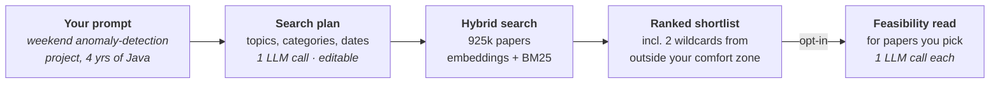
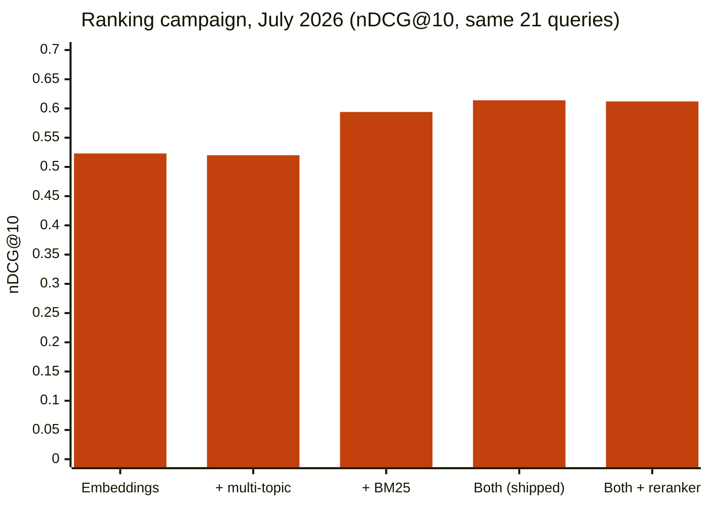

# Fatwood

[fatwood.io](https://fatwood.io)

<!--
  Every number below is re-derivable — re-run these before quoting or editing
  one. The paper count goes stale on its own: ingestion runs a nightly delta
  (Ingestion:Schedule in appsettings.json), so the corpus is larger today than
  whenever this file was last touched. The corpus size appears twice — in the
  paragraph below and in the "How it works" diagram — so fix both copies or
  the next reader gets two answers.

    # corpus size + the category facet, from production
    curl -sL https://www.fatwood.io/api/papers?page=1\&pageSize=1 |
      python3 -c 'import json,sys; print(json.load(sys.stdin)["totalItems"], "papers")'
    curl -sL https://www.fatwood.io/api/categories |
      python3 -c 'import json,sys; print(len(json.load(sys.stdin)), "live categories")'

  The per-category `paperCount` that endpoint returns is a count of category
  *assignments*, so summing it gives roughly twice the corpus size (papers are
  cross-listed). It is not the paper count; do not add it up.

    # harvest targets, from config
    python3 -c 'import json; print(len(json.load(open(
      "src/ResearchDiscovery.Api/appsettings.json"))["Arxiv"]["Categories"]))'

    # eval set + judgments, from the repo (no build, no database)
    python3 -c 'import json; q=json.load(open("eval/queries.json"))["queries"]; \
      j=json.load(open("eval/judgments.json"))["judgments"]; \
      print(sum(1 for x in q if x["plan"] is not None), "scored queries;", \
      len(j), "judgments")'

  nDCG@10 and the CI floor are not derivable without a run — they come from
  docs/search-quality.md, which records the campaign that produced them.
-->

Fatwood helps engineers find research papers worth building as side
projects. You describe your background and goals in plain English. It
searches **~925,000 arXiv papers** and returns a ranked
shortlist. For any paper you pick, it can also write a personal feasibility
read: what you'd learn, how long the build would take, and how it would read
on a resume.

<!-- TODO: screenshot of a search → results page (plan chips + wildcard badges) -->

## How it works

```mermaid
flowchart LR
    prompt["<b>Your prompt</b><br/><i>weekend anomaly-detection<br/>project, 4 yrs of Java</i>"]
    plan["<b>Search plan</b><br/>topics, categories, dates<br/><i>1 LLM call · editable</i>"]
    search["<b>Hybrid search</b><br/>925k papers<br/>embeddings + BM25"]
    results["<b>Ranked shortlist</b><br/>incl. 2 wildcards from<br/>outside your comfort zone"]
    analysis["<b>Feasibility read</b><br/>for papers you pick<br/><i>1 LLM call each</i>"]

    prompt --> plan --> search --> results -->|opt-in| analysis
```

1. **An LLM turns your prompt into a search plan.** That's one call per search.
   The plan shows up as editable chips, and editing a chip re-runs the search
   without another LLM call.
2. **Search runs locally, with no LLM involved.** Every abstract is embedded
   ahead of time (bge-small via ONNX, 384 dimensions, int8-quantized in
   memory). Results come from meaning similarity fused with BM25 keyword
   matching.
3. **Two results are wildcards on purpose.** They're relevant papers
   furthest from your stated experience, because the point is to stretch
   what you can build.
4. **Analysis is opt-in and costs a call per paper.** It's cached per paper ×
   profile, and the UI shows a dollar estimate before you spend anything.

New to BM25, embeddings or nDCG? See [Terminology](#terminology).

## Every ranking change is measured

An offline eval harness scores the ranker against 54 frozen queries and
~8,200 graded relevance judgments. CI fails any PR that drops nDCG@10 below
**0.590**; the current ranker scores **0.628**. Several ideas that seemed
obviously good were dropped because the numbers said so:

```mermaid
%%{init: {"themeVariables": {"xyChart": {"plotColorPalette": "#c2410c"}}}}%%
xychart-beta
    title "Ranking campaign, July 2026 (nDCG@10, same 21 queries)"
    x-axis ["Embeddings", "+ multi-topic", "+ BM25", "Both (shipped)", "Both + reranker"]
    y-axis "nDCG@10" 0 --> 0.7
    bar [0.523, 0.520, 0.594, 0.614, 0.612]
```

Hybrid search shipped with a **+17%** gain. The cross-encoder reranker
didn't ship, because it was a wash. The full methodology and campaign history
are in [docs/search-quality.md](docs/search-quality.md).

## Terminology

### Search

**arXiv** — A free, public site where researchers post papers, often before
formal publication. All of Fatwood's papers come from it.

**Embedding** — A list of numbers that represents the *meaning* of a piece
of text. Texts about similar things get similar numbers, even when they use
different words. "Detecting fraud in transactions" and "anomaly detection
for payments" end up close together. Fatwood embeds every paper's title and
abstract ahead of time, and your search plan at query time, then looks for
the papers closest to your plan.

**bge-small / ONNX** — bge-small is the small, free embedding model Fatwood
uses. Each text becomes 384 numbers. ONNX is a portable model format that
lets it run inside the .NET app, so embedding costs nothing and needs no
external API.

**int8 quantization** — Storing each of those 384 numbers in 1 byte
instead of 4. You lose a little precision, but 925k papers fit in memory
and comparisons get much faster.

**BM25** — The classic keyword-search formula, essentially what search
engines used before embeddings. It scores a paper higher when it contains
your exact words, especially rare ones. It also stops rewarding a word after
it appears enough times, and adjusts for document length. It catches what
embeddings blur: acronyms, model names, exact jargon like "LoRA" or "SLAM".

**Hybrid search** — Running embedding search and BM25 side by side, then
combining the two rankings. Each covers the other's blind spots. In
Fatwood, this was the single biggest measured improvement.

**Reciprocal Rank Fusion (RRF)** — The simple rule that combines those two
rankings. Each paper scores `1 / (60 + its rank)` in each list, and the
scores are added. A paper near the top of both lists wins. Because it only
uses rank positions, the two systems' very different raw scores never need
to be compared directly.

**Cross-encoder / reranker** — A slower, more careful model that reads your
query and a paper *together* and scores how well they match. It usually
re-sorts only the top results. Fatwood tested one, measured no gain, and
left it off.

**Wildcard** — Fatwood's own term. Two result slots are reserved for highly
relevant papers that are furthest from your stated experience, so results
don't only reflect what you already know.

### Measurement

**Eval harness** — A test suite for search quality instead of code. It
runs a fixed set of queries through the ranker and scores the results
against known-good answers.

**Relevance judgment** — One graded answer: "for query X, paper Y is a 0
(irrelevant) to 3 (great match)." Fatwood's ~8,200 judgments were graded by
an LLM against a written rubric and are stored in the repo.

**nDCG@10** — The headline score. It looks at the top 10 results and asks
how close they are to the best possible top 10. Great papers count more,
and so do results ranked higher. 1.0 is perfect; 0 means nothing relevant.
Fatwood's 0.628 means the top 10 captures about 63% of the ideal.

**Recall@50** — Of all the papers known to be relevant, the share that
appear anywhere in the top 50.

**MRR (Mean Reciprocal Rank)** — How high the *first* good result lands,
averaged across queries. First place scores 1, second place ½, third ⅓,
and so on.

**Interleaving** — A live A/B test for rankers. Results from two rankers
are mixed into one list, and each user action on a result, such as a
bookmark or an analysis, counts as a vote for the ranker that supplied it.
Fatwood supports this but keeps it off by default, and a human decides
whether the winner ships.

## Tech stack

| Layer | Choice |
|---|---|
| Backend | .NET 10 / ASP.NET Core, layered (Domain / Application / Infrastructure / Api), web + CLI from one entry point |
| Data | PostgreSQL via EF Core, kept portable to SQL Server (no raw SQL, no pg-only types) |
| Search | Local ONNX embeddings, in-memory int8 vector index + BM25, Reciprocal Rank Fusion; indexes snapshot to blob storage for fast cold start |
| LLM | Anthropic API with structured outputs, per-step model selection and pricing |
| Frontend | React + TypeScript (Vite) |
| Accounts | Entra External ID (native in-app auth), per-user dollar budget, bring-your-own API key |
| Delivery | Single Docker image, Bicep IaC, GitHub Actions (OIDC), Azure Container Apps, Cloudflare at the edge |
| Quality | IR eval harness (nDCG / Recall / MRR) as a CI gate, search telemetry, interleaving experiments |

## Documentation

| Doc | What's in it |
|---|---|
| [docs/running.md](docs/running.md) | Run it locally, configuration, tests |
| [docs/operations.md](docs/operations.md) | Ingestion, embeddings, analysis, enrichment, cost controls |
| [docs/search-quality.md](docs/search-quality.md) | Eval harness, measurement protocol, ranking campaigns |
| [docs/accounts.md](docs/accounts.md) | Auth, budget ledger, BYO keys, email, rate limiting |
| [docs/design-decisions.md](docs/design-decisions.md) | The explicit trade-offs and why |
| [DEPLOY.md](DEPLOY.md) | Azure deployment |
