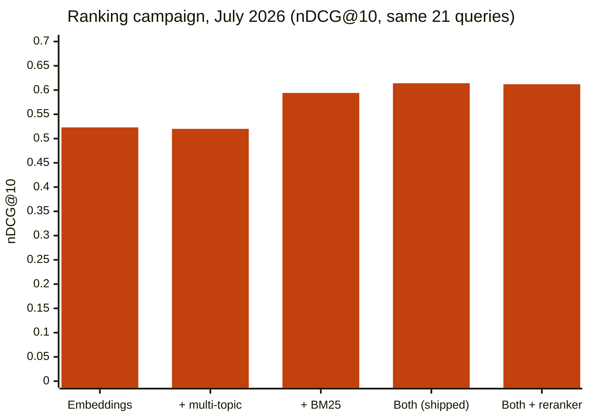

# Fatwood

[fatwood.io](https://fatwood.io)

Fatwood helps engineers find research papers worth building as side
projects. You describe your background and goals in plain English. It
searches **~910,000 arXiv papers across 37 categories** and returns a ranked
shortlist. For any paper you pick, it can also write a personal feasibility
read: what you'd learn, how long the build would take, and how it would read
on a resume.

<<<<<<< HEAD
<!-- TODO: screenshot of a search → results page (plan chips + wildcard badges) -->
=======
<!--
  Every number below is re-derivable — re-run these before quoting or editing
  one. The paper count goes stale on its own: ingestion runs a nightly delta
  (Ingestion:Schedule in appsettings.json), so the corpus is larger today than
  whenever this file was last touched. The corpus size and the category count
  each appear twice — in the paragraph below and in "How a sentence becomes
  insights" step 2 — so fix both copies or the next reader gets two answers.

    # corpus size + the category facet, from production
    curl -sL https://www.fatwood.io/api/papers?page=1\&pageSize=1 |
      python3 -c 'import json,sys; print(json.load(sys.stdin)["totalItems"], "papers")'
    curl -sL https://www.fatwood.io/api/categories |
      python3 -c 'import json,sys; print(len(json.load(sys.stdin)), "live categories")'

  The per-category `paperCount` that endpoint returns is a count of category
  *assignments*, so summing it gives roughly twice the corpus size (papers are
  cross-listed). It is not the paper count; do not add it up.

    # harvest targets, from config
    python3 -c 'import json; print(len(json.load(open(
      "src/ResearchDiscovery.Api/appsettings.json"))["Arxiv"]["Categories"]))'

    # eval set + judgments, from the repo (no build, no database)
    python3 -c 'import json; q=json.load(open("eval/queries.json"))["queries"]; \
      j=json.load(open("eval/judgments.json"))["judgments"]; \
      print(sum(1 for x in q if x["plan"] is not None), "scored queries;", \
      len(j), "judgments")'

  nDCG@10 and the CI floor are not derivable without a run — they come from
  docs/search-quality.md, which records the campaign that produced them.
-->

arXiv publishes hundreds of papers a day across machine learning, security,
robotics, signal processing, computational biology, and quantitative finance.
Fatwood indexes a decade of them — **~925,000 papers**, harvested from 37
target arXiv categories and carrying cross-listings that spread the corpus
across **155 categories** in all. Somewhere in there is a paper that would
make a fantastic project for *you specifically* — the right topic for where
your career is going, the right scope for a solo build, maybe a result nobody
has reproduced in public yet. The problem is finding it: keyword search
doesn't know you, category feeds are a firehose, and reading 300 abstracts a
day is a job.
>>>>>>> origin/main

## How it works

```mermaid
flowchart LR
    prompt["<b>Your prompt</b><br/><i>weekend anomaly-detection<br/>project, 4 yrs of Java</i>"]
    plan["<b>Search plan</b><br/>topics, categories, dates<br/><i>1 LLM call · editable</i>"]
    search["<b>Hybrid search</b><br/>910k papers<br/>embeddings + BM25"]
    results["<b>Ranked shortlist</b><br/>incl. 2 wildcards from<br/>outside your comfort zone"]
    analysis["<b>Feasibility read</b><br/>for papers you pick<br/><i>1 LLM call each</i>"]

    prompt --> plan --> search --> results -->|opt-in| analysis
```

1. **An LLM turns your prompt into a search plan.** That's one call per search.
   The plan shows up as editable chips, and editing a chip re-runs the search
   without another LLM call.
2. **Search runs locally, with no LLM involved.** Every abstract is embedded
   ahead of time (bge-small via ONNX, 384 dimensions, int8-quantized in
   memory). Results come from meaning similarity fused with BM25 keyword
   matching.
3. **Two results are wildcards on purpose.** They're relevant papers
   furthest from your stated experience, because the point is to stretch
   what you can build.
4. **Analysis is opt-in and costs a call per paper.** It's cached per paper ×
   profile, and the UI shows a dollar estimate before you spend anything.

## Every ranking change is measured

<<<<<<< HEAD
An offline eval harness scores the ranker against 54 frozen queries and
~7,400 graded relevance judgments. CI fails any PR that drops nDCG@10 below
**0.590**; the current ranker scores **0.628**. Several ideas that seemed
obviously good were dropped because the numbers said so:
=======
- **Search quality must be measurable — or none of this means anything.**
  An evaluation harness turns "are the results good?" into a number (nDCG@10
  = 0.628 over ~8,200 graded relevance judgments across 54 frozen queries,
  with a CI gate that fails any PR dropping below 0.590). No ranking change
  ships unless the number goes up; several "obviously good" ideas died in
  measurement, and that's the system working.
- **Exploration is protected, structurally.** A great project must never be
  missed over a skill you could learn in a weekend. Experience similarity
  annotates results but never ranks or gates them; wildcard slots are a
  contractual guarantee; analysis treats unfamiliar tools as learnable,
  never as blockers.
- **Tokens are spent deliberately and visibly.** The LLM never filters the
  corpus — it compiles your intent (once per search) and analyzes papers you
  explicitly choose, on the cheapest capable model, with live dollar
  estimates in the UI. Browsing and searching cost zero tokens, always.
- **Real data only.** Every paper is live from arXiv, every citation from
  Semantic Scholar, every quality claim from actual measurement. Mock data
  is banned from the product path.
- **Improve from real usage — with a human in the loop.** Every search and
  reaction is logged; reports surface biases and candidates; nothing retunes
  itself automatically. Detect automatically, tweak deliberately.
- **Open to anyone, safe to run.** Real accounts (Entra External ID, rendered
  natively in-app), a per-user dollar budget bounding every account's spend,
  rate limiting and bot protection at every layer, and cost alarms above it
  all — shareable without fearing the bill.
- **Production-grade, portable engineering.** Provider-swappable database,
  140 tests, infrastructure as code, CI/CD — built to hold up under review.
>>>>>>> origin/main

```mermaid
%%{init: {"themeVariables": {"xyChart": {"plotColorPalette": "#c2410c"}}}}%%
xychart-beta
    title "Ranking campaign, July 2026 (nDCG@10, same 21 queries)"
    x-axis ["Embeddings", "+ multi-topic", "+ BM25", "Both (shipped)", "Both + reranker"]
    y-axis "nDCG@10" 0 --> 0.7
    bar [0.523, 0.520, 0.594, 0.614, 0.612]
```

<<<<<<< HEAD
Hybrid search shipped with a **+17%** gain. The cross-encoder reranker
didn't ship, because it was a wash. The full methodology and campaign history
are in [docs/search-quality.md](docs/search-quality.md).
=======
1. **One LLM call compiles your prose into a transparent, editable plan** —
   concrete research topics, category filters, a date window, shown as chips.
   Editing a chip re-runs the search free: only compilation and opt-in
   analysis ever spend tokens.
2. **Date and category filters** narrow ~925k papers — a decade of arXiv
   across 155 categories — to your candidates in milliseconds, pushed into
   the index scan itself rather than a full-corpus query.
3. **Meaning does the ranking**: every abstract is a point in a
   384-dimensional space (local embeddings — bge-small via ONNX, no API);
   relevance is geometric closeness to your intent *and* your best-matching
   topic — including a HyDE anchor, the abstract of the hypothetical ideal
   paper the compiler writes for your search (measured +0.02 nDCG, biggest
   wins on queries phrased nothing like paper language).
4. **Exact words get a vote**: a BM25 text index runs in parallel and the
   rankings fuse — this hybrid measured **+17% nDCG** over embeddings alone.
5. **Wildcard slots** inject high-relevance papers least similar to your
   experience before results render.
6. **Opt-in analysis** reads each chosen paper against your profile:
   feasibility, learning bridge, goal alignment, resume story, extension
   idea. Cached forever per paper × profile version.
7. **Every search feeds the quality loop**: telemetry + an offline eval
   harness (frozen queries, graded judgments, nDCG/Recall/MRR) gate every
   ranking change. The current pipeline exists because measurement picked it.

>>>>>>> origin/main

## Tech stack

| Layer | Choice |
|---|---|
| Backend | .NET 10 / ASP.NET Core, layered (Domain / Application / Infrastructure / Api), web + CLI from one entry point |
| Data | PostgreSQL via EF Core, kept portable to SQL Server (no raw SQL, no pg-only types) |
| Search | Local ONNX embeddings, in-memory int8 vector index + BM25, Reciprocal Rank Fusion; indexes snapshot to blob storage for fast cold start |
| LLM | Anthropic API with structured outputs, per-step model selection and pricing |
| Frontend | React + TypeScript (Vite) |
| Accounts | Entra External ID (native in-app auth), per-user dollar budget, bring-your-own API key |
| Delivery | Single Docker image, Bicep IaC, GitHub Actions (OIDC), Azure Container Apps, Cloudflare at the edge |
| Quality | IR eval harness (nDCG / Recall / MRR) as a CI gate, search telemetry, interleaving experiments |

## Documentation

| Doc | What's in it |
|---|---|
| [docs/running.md](docs/running.md) | Run it locally, configuration, tests |
| [docs/operations.md](docs/operations.md) | Ingestion, embeddings, analysis, enrichment, cost controls |
| [docs/search-quality.md](docs/search-quality.md) | Eval harness, measurement protocol, ranking campaigns |
| [docs/accounts.md](docs/accounts.md) | Auth, budget ledger, BYO keys, email, rate limiting |
| [docs/design-decisions.md](docs/design-decisions.md) | The explicit trade-offs and why |
| [DEPLOY.md](DEPLOY.md) | Azure deployment |
