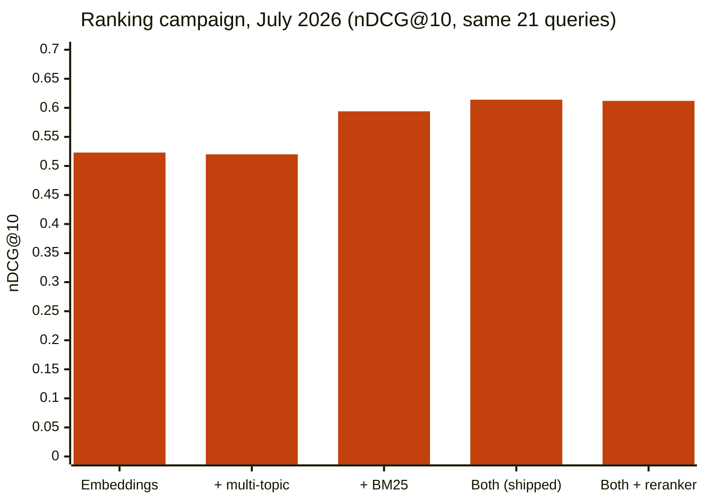

# Fatwood

[fatwood.io](https://fatwood.io)

Fatwood helps engineers find research papers worth building as side
projects. You describe your background and goals in plain English. It
searches **~910,000 arXiv papers across 37 categories** and returns a ranked
shortlist. For any paper you pick, it can also write a personal feasibility
read: what you'd learn, how long the build would take, and how it would read
on a resume.

<!-- TODO: screenshot of a search → results page (plan chips + wildcard badges) -->

## How it works

```mermaid
flowchart LR
    prompt["<b>Your prompt</b><br/><i>weekend anomaly-detection<br/>project, 4 yrs of Java</i>"]
    plan["<b>Search plan</b><br/>topics, categories, dates<br/><i>1 LLM call · editable</i>"]
    search["<b>Hybrid search</b><br/>910k papers<br/>embeddings + BM25"]
    results["<b>Ranked shortlist</b><br/>incl. 2 wildcards from<br/>outside your comfort zone"]
    analysis["<b>Feasibility read</b><br/>for papers you pick<br/><i>1 LLM call each</i>"]

    prompt --> plan --> search --> results -->|opt-in| analysis
```

1. **An LLM turns your prompt into a search plan.** That's one call per search.
   The plan shows up as editable chips, and editing a chip re-runs the search
   without another LLM call.
2. **Search runs locally, with no LLM involved.** Every abstract is embedded
   ahead of time (bge-small via ONNX, 384 dimensions, int8-quantized in
   memory). Results come from meaning similarity fused with BM25 keyword
   matching.
3. **Two results are wildcards on purpose.** They're relevant papers
   furthest from your stated experience, because the point is to stretch
   what you can build.
4. **Analysis is opt-in and costs a call per paper.** It's cached per paper ×
   profile, and the UI shows a dollar estimate before you spend anything.

## Every ranking change is measured

An offline eval harness scores the ranker against 54 frozen queries and
~7,400 graded relevance judgments. CI fails any PR that drops nDCG@10 below
**0.590**; the current ranker scores **0.628**. Several ideas that seemed
obviously good were dropped because the numbers said so:

```mermaid
%%{init: {"themeVariables": {"xyChart": {"plotColorPalette": "#c2410c"}}}}%%
xychart-beta
    title "Ranking campaign, July 2026 (nDCG@10, same 21 queries)"
    x-axis ["Embeddings", "+ multi-topic", "+ BM25", "Both (shipped)", "Both + reranker"]
    y-axis "nDCG@10" 0 --> 0.7
    bar [0.523, 0.520, 0.594, 0.614, 0.612]
```

Hybrid search shipped with a **+17%** gain. The cross-encoder reranker
didn't ship, because it was a wash. The full methodology and campaign history
are in [docs/search-quality.md](docs/search-quality.md).

## Tech stack

| Layer | Choice |
|---|---|
| Backend | .NET 10 / ASP.NET Core, layered (Domain / Application / Infrastructure / Api), web + CLI from one entry point |
| Data | PostgreSQL via EF Core, kept portable to SQL Server (no raw SQL, no pg-only types) |
| Search | Local ONNX embeddings, in-memory int8 vector index + BM25, Reciprocal Rank Fusion; indexes snapshot to blob storage for fast cold start |
| LLM | Anthropic API with structured outputs, per-step model selection and pricing |
| Frontend | React + TypeScript (Vite) |
| Accounts | Entra External ID (native in-app auth), per-user dollar budget, bring-your-own API key |
| Delivery | Single Docker image, Bicep IaC, GitHub Actions (OIDC), Azure Container Apps, Cloudflare at the edge |
| Quality | IR eval harness (nDCG / Recall / MRR) as a CI gate, search telemetry, interleaving experiments |

## Documentation

| Doc | What's in it |
|---|---|
| [docs/running.md](docs/running.md) | Run it locally, configuration, tests |
| [docs/operations.md](docs/operations.md) | Ingestion, embeddings, analysis, enrichment, cost controls |
| [docs/search-quality.md](docs/search-quality.md) | Eval harness, measurement protocol, ranking campaigns |
| [docs/accounts.md](docs/accounts.md) | Auth, budget ledger, BYO keys, email, rate limiting |
| [docs/design-decisions.md](docs/design-decisions.md) | The explicit trade-offs and why |
| [DEPLOY.md](DEPLOY.md) | Azure deployment |
